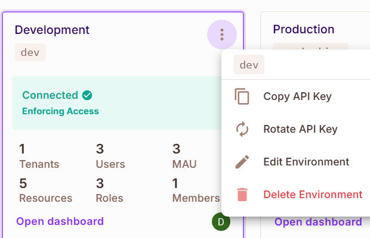
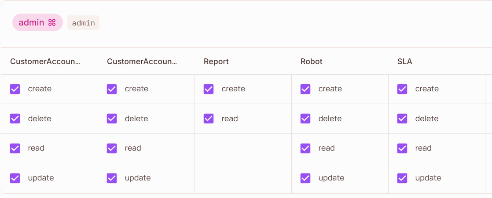
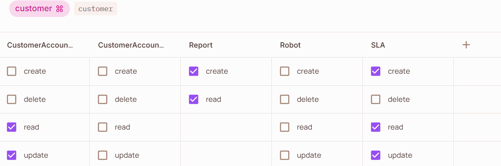
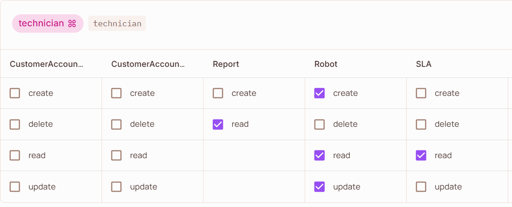
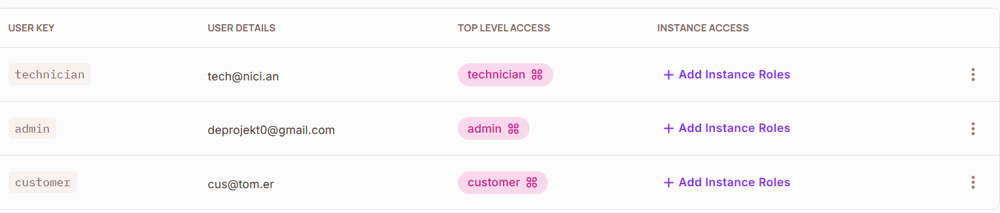

# Robotic-Lawnmower-Administration-Service
## Project Description
The purpose of this project is to develop a centralized system for managing service-level agreements (SLAs) for robotic lawnmowers, enablingbusinesses to move from product-centric to service-centric models. The system consists of a web-based frontend where customers can create, modify, or teminate SLAs (e.g., adjusting grass height or working area) and multiple administrative interfaces for managing SLAs and related resources. All operations are tracked in an immutable log, ensuring transparency and accountability.
  
The backend consists of a REST API to support future types of frontends (e.g., mobile apps). It implements all the logic of the system, e.g., workflows for dynamic SLAs and role-based access control which provide flexibility and security. Inspired by a decentralized approach, this project focuses on scalability and user-based workflows for service management.

## Installation 

### Requirements
Node.js v22.14.0 (or higher)  
MongoDB database (Can be either on the cloud, e.g., MongoDB Atlas, or local)  
Permit.io account  

### MongoDB
If you want to use Atlas as we did you can follow: https://www.mongodb.com/docs/atlas/getting-started/  
Follow the instructions and paste the connection link in the .env file in the CONNECTION_STRING variabel.
You should also be able to run Mongodb locally.

### Permit.io
Begin by creating a new project, then before opening the Dashboard for the newly project and copy the its API key as shown below.  
  

Now in the code directory, replace the mockup API key in the backend/Middleware/authorization.js with yours. Afterwards go back to the  
Permit.io web application and select **Policy** in the sidebar. From there create 3 roles: **admin**, **customer**, and **technician**. 
The next step will be to create all the resources. For each resource provide a name and the methods allowed based on the following table 

| Actions | SLA | Robot | Reports | CustomerAccountInfo | CustomerAccountInfoPrivate |
|---------|-----|-------|---------|---------------------|----------------------------|
| read    | Yes | Yes   | Yes     | Yes                 | Yes                        |
| create  | Yes | Yes   | Yes     | Yes                 | Yes                        |
| update  | Yes | Yes   | No      | Yes                 | Yes                        |
| delete  | No  | Yes   | No      | Yes                 | Yes                        |

After having defined the resources and their allowed methods, you will have to map the methods to each role. Set the mappings for  
each role in the **Policy Editor** by following the images below. 

 

Lastly, navigate to **Directory** from the sidebar, and then create a user, which will be used to communicate with the service, for  
each role. Make sure that the respective **USER KEYS** and the **TOP LEVEL ACCESS** are the same as shown below. The user details    
can be anything, common practice is to use an email for some use cases. 

Once done with this part, the authorization set up using Permit.io should be complete.

### (Optional) Enable email notifications
When a SLA log is updated there is a possibility to have the changes being emailed to the customer. To enable this functionality  
you need an email, which will represent the system/corporation. Once the email is ready, start by removing the comments from line 
19-46 in **backend/Middleware/logSlaEvent**, then replace the email at lines 27 and 33 with yours. For line 28 there different    
options depending on the service, for example the one being shown is a gmail application password that can be generated in the    
throught the emails settings. 

### Final step 
Go into the **/backend** and **/web-app** folders respectively, and run the command **npm run install** to download all the         
application dependecies. To start the API (backend) you only need to run **npm run start** (or npm run dev for a development server  with nodemon). Complications can sometimes arise due to dependencies in which case you have to delete the **node_modules** map and   reinstall them again with **npm run install**. To start the web-app you can either build the static files with **npm run build**    
and then view them with **npm run preview**, or you can just the development server by running **npm run dev**.

## API Documentation
The documentation for the REST API are available in the swagger.yaml file stored in the backend directory.  
To view the document one can either start up the backend and visit the /api-docs route or simply paste the  
file content in a swagger editor, e.g., at https://editor.swagger.io/.

## Directory Structure

├── backend 
│   ├── Controllers 
│   │   ├── adminController.js 
│   │   ├── customerController.js 
│   │   ├── robotController.js 
│   │   ├── slaController.js 
│   │   └── userController.js 
│   ├── Middleware 
│   │   ├── ValidUser.js 
│   │   ├── ValidateTokenHandler.js 
│   │   ├── authorization.js 
│   │   ├── dateCheck.js 
│   │   ├── errorHandler.js 
│   │   ├── logSlaEvent.js 
│   │   └── priceCalculator.js 
│   ├── Models 
│   │   ├── notificationModel.js 
│   │   ├── priceListModel.js 
│   │   ├── reportModel.js 
│   │   ├── robotModel.js 
│   │   ├── slaLogModel.js 
│   │   ├── slaModel.js 
│   │   └── userModel.js 
│   ├── Routes 
│   │   ├── robotRoutes.js 
│   │   ├── slaRoutes.js 
│   │   └── userRoutes.js 
│   ├── config 
│   │   └── dbConnection.js 
│   ├── constants.js 
│   ├── index.js 
│   └── package.json 
├── package-lock.json 
└── web-app 
    ├── README.md 
    ├── index.html 
    ├── package.json 
    ├── src 
    │   ├── App.vue 
    │   ├── assets 
    │   │   └── main.css 
    │   ├── components 
    │   │   ├── AdminNavBar.vue 
    │   │   ├── CustomerNavBar.vue 
    │   │   ├── Logout.vue 
    │   │   ├── ModelPricing.vue 
    │   │   ├── Navbar.vue 
    │   │   └── TechNavBar.vue 
    │   ├── config 
    │   │   └── axios.js 
    │   ├── main.js 
    │   ├── router 
    │   │   └── index.js 
    │   └── views 
    │       ├── AdminViews 
    │       │   ├── AdminContractView.vue 
    │       │   ├── AdminCreateUser.vue 
    │       │   ├── AdminMowerView.vue 
    │       │   ├── EditUser.vue 
    │       │   ├── PriceLists.vue 
    │       │   ├── UpdateContractAsCustomer.vue 
    │       │   ├── UpdatePriceList.vue 
    │       │   └── UserManagement.vue 
    │       ├── CustomerViews 
    │       │   ├── CustomerConfirmOrder.vue 
    │       │   ├── CustomerContract.vue 
    │       │   ├── CustomerContractReport.vue 
    │       │   ├── CustomerContracts.vue 
    │       │   ├── CustomerLog.vue 
    │       │   ├── CustomerNewOrder.vue 
    │       │   ├── CustomerProfile.vue 
    │       │   └── CustomerUpdateContract.vue 
    │       ├── HomeView.vue 
    │       ├── LoginView.vue 
    │       ├── Pricing.vue 
    │       ├── SignUpView.vue 
    │       └── TechnicianViews 
    │           ├── EditMower.vue 
    │           ├── TechAddMower.vue 
    │           ├── TechHandleReportView.vue 
    │           ├── TechMowersView.vue 
    │           └── TechReportsView.vue 

## Group Members
Erik Helgesson,       rekhel-9@student.ltu.se  
Kalle Hedberg,        kalhed-2@student.ltu.se  
Sebastian Pettersson, sebpet-9@student.ltu.se  
Dispatch,             dispat-2@student.ltu.se
